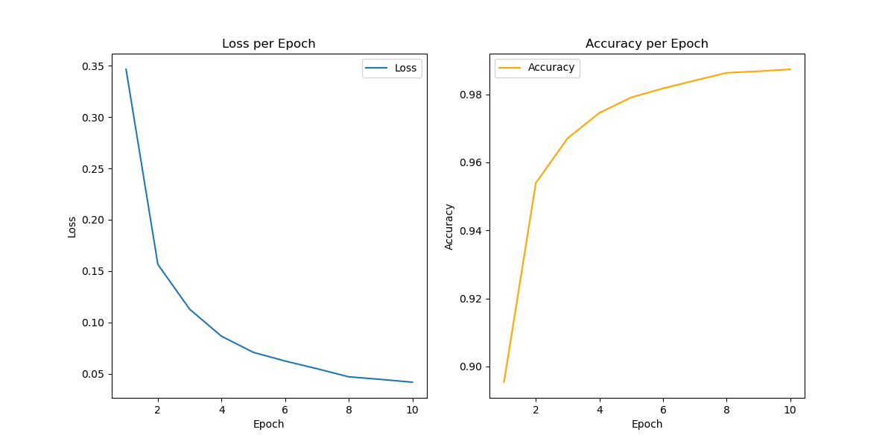
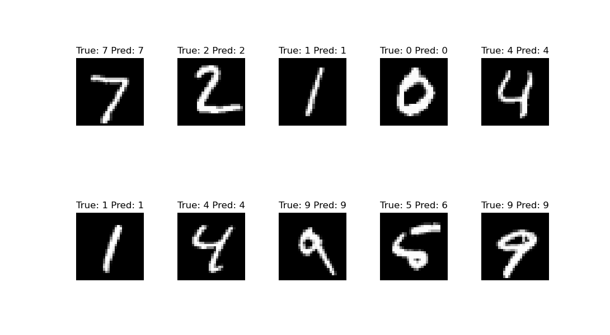
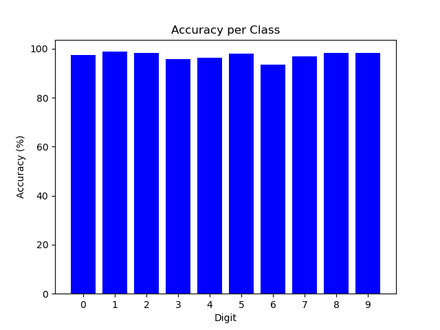

# MNIST Classifier with Fully Connected Neural Network

This project demonstrates a fully connected neural network model for classifying handwritten digits from the popular **MNIST dataset**. The model is trained using PyTorch and achieves high accuracy on both the training and test sets.

---

## About the MNIST Dataset

The MNIST dataset is a benchmark dataset for handwritten digit classification. It contains **60,000 training images** and **10,000 test images** of digits ranging from 0 to 9, with each image being grayscale and of size 28x28 pixels.  
For more details, visit the official [MNIST Database](http://yann.lecun.com/exdb/mnist/).

---

## Objective and Approach

### **Objective**  
The goal is to classify the handwritten digits in the MNIST dataset with high accuracy using a simple fully connected neural network.

### **Approach**  
1. **Data Preparation**  
   - Normalize the images to have pixel values between 0 and 1.
   - Use a training set for model training and a separate test set for evaluation.

2. **Model Design**  
   - A fully connected neural network with two hidden layers.
   - Activation function: ReLU for non-linearity.
   - Output layer: Softmax for probability distribution over 10 classes.

3. **Training**  
   - Loss function: Cross-Entropy Loss.
   - Optimizer: Adam optimizer with a learning rate of 0.001.
   - Epochs: 10.
   - Batch size: 64.

4. **Testing**  
   - Evaluate the model on the test dataset to measure accuracy for each digit class.

---

## Results

### **Training Progress**

Epoch [1/10], Loss: 0.3465, Accuracy: 0.8954
Epoch [2/10], Loss: 0.1564, Accuracy: 0.9539
Epoch [3/10], Loss: 0.1128, Accuracy: 0.9671
Epoch [4/10], Loss: 0.0864, Accuracy: 0.9746
Epoch [5/10], Loss: 0.0708, Accuracy: 0.9791
Epoch [6/10], Loss: 0.0623, Accuracy: 0.9818
Epoch [7/10], Loss: 0.0549, Accuracy: 0.9841
Epoch [8/10], Loss: 0.0469, Accuracy: 0.9863
Epoch [9/10], Loss: 0.0444, Accuracy: 0.9868
Epoch [10/10], Loss: 0.0417, Accuracy: 0.9874
‍‍
### Class-wise Accuracy on Test Data

Class 0: 97.35%
Class 1: 98.77%
Class 2: 98.35%
Class 3: 95.84%
Class 4: 96.44%
Class 5: 98.09%
Class 6: 93.42%
Class 7: 96.98%
Class 8: 98.36%
Class 9: 98.32%

---

## Visual Results

Below are sample visualizations of the model's predictions:

1. 
2. 
3. 

---

## Notes for Users

### Saving the Model  
By default, the last line of `mnist_classifier.py` is commented out to prevent overwriting the saved model (`model.pth`). If you'd like to save the model after retraining, uncomment the following line in `mnist_classifier.py`:

```python
torch.save(model.state_dict(), 'model.pth')
```
---

## How to Run User Input Predictions

You can use the user_input.py script to classify a handwritten digit based on the trained model. Follow these steps:
	1.	Ensure the trained model file (model.pth) exists in the project directory. If not, retrain the model or download it.
	2.	Open a terminal and navigate to the project directory.
	3.	Run the following command:
    
```bash
python user_input.py model.pth
```
    •	Follow the instructions in the terminal:
	•	Provide the path to a 28x28 grayscale digit image, or
	•	Draw a digit on the pop-up canvas if this feature is enabled in your GUI setup.

The script will output the predicted digit along with the confidence scores for each class.